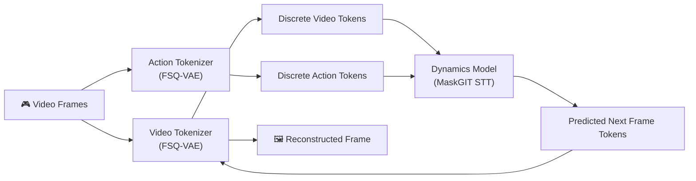
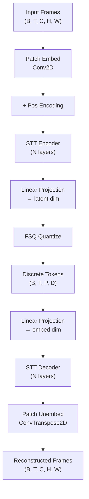
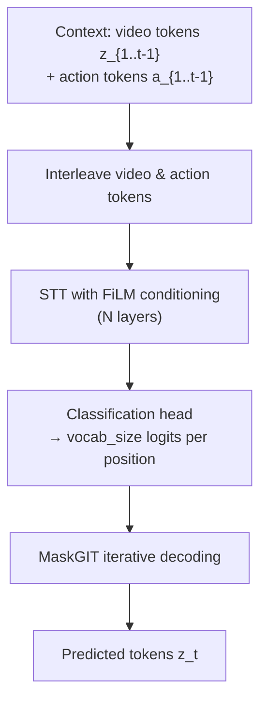

# 🌍 Building Your Own Mini Genie: A Complete Roadmap

> A step-by-step guide to building a world model inspired by DeepMind's Genie, using [TinyWorlds](https://github.com/AlmondGod/tinyworlds) as reference.

---

## The Big Picture

Your project has **three core modules** that work together:



> [!IMPORTANT]
> **You must build and train these modules in order**: Video Tokenizer → Action Tokenizer → Dynamics Model. Each depends on the previous one being functional.

---

## Required Research Papers

Since you've read these, use this as a quick-reference checklist:

| Paper | What You Need From It |
|-------|----------------------|
| [Genie: Generative Interactive Environments](https://arxiv.org/pdf/2402.15391) | The full architecture — your north star |
| [TimeSformer (Space-Time Transformer)](https://arxiv.org/pdf/2001.02908) | How spatial & temporal attention are factored |
| [FSQ: Finite Scalar Quantization](https://arxiv.org/pdf/2309.15505) | Replaces VQ-VAE codebook; simpler, no codebook collapse |
| [VAE Tutorial](https://arxiv.org/pdf/1906.02691) | Encoder-decoder with latent bottleneck |
| [MaskGIT](https://arxiv.org/pdf/2202.04200) | Parallel iterative decoding for dynamics |
| [SwiGLU](https://arxiv.org/pdf/2002.05202) | FFN activation used in transformer blocks |
| [FiLM Conditioning](https://arxiv.org/pdf/1709.07871) | How actions condition the transformer norm layers |
| [World Models (Ha & Schmidhuber)](https://arxiv.org/pdf/1803.10122) | Foundational motivation for the project |

---

## Phase 0: Prerequisites & Environment Setup
**⏱️ Estimated time: 2–3 days**

### What You Need to Know
- **PyTorch** — confident with `nn.Module`, custom training loops, `autograd`
- **Transformers** — self-attention, multi-head attention, positional encodings
- **VAEs** — encoder/decoder, reparameterization trick, ELBO loss
- **einops** — tensor reshaping library used heavily in tinyworlds

### What to Build
1. Set up your project scaffold:
   ```
   mini-genie/
   ├── models/           # All neural network modules
   ├── datasets/          # Data loading and preprocessing
   ├── scripts/           # Training and inference entry points
   ├── configs/           # YAML configuration files
   ├── utils/             # Helpers (logging, distributed, config parsing)
   ├── checkpoints/       # Saved model weights
   └── requirements.txt
   ```

2. Install core dependencies: `torch`, `einops`, `wandb`, `h5py`, `pyyaml`, `huggingface_hub`

3. Set up experiment tracking with **Weights & Biases** (wandb)

### Warm-Up Exercises (do these if concepts feel shaky)
- [ ] Build a vanilla autoencoder on MNIST — verify it reconstructs digits
- [ ] Build a single self-attention layer from scratch — verify attention weights make sense
- [ ] Implement the straight-through estimator (STE) on a toy example

### ✅ Checkpoint
You have a working dev environment, you can train a simple model on GPU, and you can log to wandb.

---

## Phase 1: Understand the Data Pipeline
**⏱️ Estimated time: 2–3 days**

### The Core Idea
Your training data is **gameplay video** — sequences of frames from retro games (Zelda, Sonic, Pong, etc.). There are **no action labels** — that's the whole point of Genie's approach.

### What to Build

#### 1.1 — Video-to-HDF5 Converter
- Record or download `.mp4` gameplay footage
- Extract frames at a fixed FPS (e.g., 10 FPS)
- Downsample to a small resolution (e.g., 64×64 or 80×80 pixels)
- Store as HDF5 files (`.h5`) — a dataset of shape `(N_clips, T_frames, C, H, W)`

#### 1.2 — PyTorch Dataset & DataLoader
- Load HDF5 into a `torch.utils.data.Dataset`
- Each sample = a clip of `T` consecutive frames (e.g., T=16)
- Normalize pixel values to `[0, 1]` or `[-1, 1]`
- Implement random temporal cropping for augmentation

#### 1.3 — Batch Visualizer
- Write a script that loads a batch and saves it as a grid of frames
- This is your **debugging lifeline** — you'll use it constantly

### Key Tensor Shape Convention
Learn this notation — it's used everywhere in the codebase:
```
B  = batch size          T  = num frames (time)
C  = channels (3 RGB)    H  = pixel height
W  = pixel width          P  = num patches per frame
E  = embedding dim        S  = patch size
Hp = patch grid height    Wp = patch grid width
```

### ✅ Checkpoint
You can load a batch of `(B, T, C, H, W)` tensors and visualize them as video clips.

---

## Phase 2: Build the Building Blocks
**⏱️ Estimated time: 5–7 days**

Before the three main modules, you need these reusable components.

### 2.1 — Patch Embedding Layer
**Paper ref**: Vision Transformer (ViT)

**What it does**: Converts an image into a sequence of patch embeddings using 2D convolutions.

**How to build it**:
- Input: `(B, C, H, W)` image
- Use `nn.Conv2d(in_channels=C, out_channels=E, kernel_size=S, stride=S)` where S = patch size
- Output: `(B, P, E)` where P = (H/S) × (W/S) patches

**How to verify**: Check that output shape is correct. Reconstruct patches visually to confirm they tile the image.

### 2.2 — Positional Encoding
**What it does**: Adds position information so the transformer knows where each patch is in space and time.

**How to build it**:
- Use **learned** positional embeddings (simpler than sinusoidal for this scale)
- You need both **spatial** (which patch in the frame) and **temporal** (which frame) encodings
- Add them: `x = x + spatial_pos_embed + temporal_pos_embed`

### 2.3 — Space-Time Transformer (STT) Block
**Paper ref**: [TimeSformer](https://arxiv.org/pdf/2001.02908)

This is the **backbone** of all three modules. Each STT block has:

```
Input → RMSNorm → Spatial Attention → RMSNorm → Temporal Attention → RMSNorm → SwiGLU FFN → Output
```

**Spatial Attention**: Each token attends to all other tokens **in the same frame**
- Reshape: `(B, T, P, E)` → `(B*T, P, E)` → standard self-attention → reshape back

**Temporal Attention**: Each token attends to the same spatial position **across previous frames**
- Reshape: `(B, T, P, E)` → `(B*P, T, E)` → **causal** self-attention → reshape back

**SwiGLU FFN**:
```
SwiGLU(x) = W₃ · [σ(W₁x + b₁) ⊙ (W₂x + b₂)] + b₃
```
Where σ = Swish activation, ⊙ = element-wise multiply

**How to verify**:
- Pass random tensors through; check shapes are preserved
- Verify temporal attention is **causal** (no attending to future frames)
- Check that spatial attention within one frame doesn't see tokens from other frames

### 2.4 — RMSNorm
**What it does**: Simpler normalization than LayerNorm — divides by RMS of activations.
```
RMSNorm(x) = x / √(mean(x²) + ε) * γ
```
PyTorch has `torch.nn.RMSNorm` in recent versions, or implement it yourself.

### 2.5 — FiLM Conditioning (for Action-Conditioned STT)
**Paper ref**: [FiLM](https://arxiv.org/pdf/1709.07871)

**What it does**: Modulates normalization based on an action vector.
```
FiLM_Norm(x, action) = (x - μ) / σ * (1 + γ(action)) + β(action)
```
Where γ and β are produced by a small MLP from the action embedding.

**When you use it**: In the Action Tokenizer decoder and Dynamics Model.

### 2.6 — Finite Scalar Quantization (FSQ)
**Paper ref**: [FSQ](https://arxiv.org/pdf/2309.15505)

**The key idea**: Instead of maintaining a codebook (like VQ-VAE), you bound each dimension to a fixed range and round to integers.

**Algorithm**:
1. `z_bounded = tanh(z)` — bounds to [-1, 1]
2. Scale to `[0, L-1]` where L = number of levels per dimension
3. `z_quantized = round(z_bounded)` — snap to integer grid
4. Scale back to `[-1, 1]`

**Straight-Through Estimator (STE)**:
- Forward: use `z_quantized`
- Backward: pretend quantization didn't happen (gradients flow through `z`, not `z_quantized`)
- Implementation: `z + (z_quantized - z).detach()`

**Vocab size** = `L^D` where D = latent dimensions per token

> [!WARNING]
> **Common pitfall**: If you forget the STE, the encoder will receive zero gradients and never learn. This is the #1 bug people hit with quantization.

### ✅ Checkpoint
You have tested each building block independently with random inputs. Shapes are correct, gradients flow, and you can stack multiple STT blocks.

---

## Phase 3: Video Tokenizer (FSQ-VAE)
**⏱️ Estimated time: 7–10 days**

### What It Does
Compresses video frames into discrete tokens, then reconstructs them. The discrete bottleneck forces it to learn a compact vocabulary of visual patterns.

### Architecture



### Step-by-Step Build Order

1. **Encoder**: Patch embed → positional encoding → stack of STT blocks → linear projection to latent dim
2. **FSQ layer**: Quantize the latent vectors
3. **Decoder**: Linear projection from latent → stack of STT blocks → patch unembed (ConvTranspose2d or pixel shuffle)
4. **Loss**: MSE reconstruction loss between input frames and reconstructed frames

### Training Recipe
- **Optimizer**: AdamW, lr ≈ 1e-4 to 3e-4
- **Batch size**: As large as your GPU allows (start with 4–8)
- **Epochs**: Train until reconstruction loss plateaus (typically 50–200 epochs depending on data size)
- **Clip length**: Start with T=4 frames, increase to T=8 or T=16 once it works

### How to Verify

| Check | What to Look For |
|-------|-----------------|
| **Reconstruction quality** | Save input vs reconstructed frames side-by-side. They should look similar. |
| **Codebook utilization** | Log how many unique tokens are actually used. If only a few are used → collapse problem. |
| **Loss curve** | Should decrease steadily. Sudden jumps = gradient issues. |
| **Latent statistics** | The pre-quantized latents should spread across the FSQ grid, not cluster. |

> [!TIP]
> **Start with a single frame** (T=1) to debug faster. Get reconstruction working on static images before adding the temporal dimension.

### Common Pitfalls
- **Blurry reconstructions**: Try adding a perceptual loss (LPIPS) or reducing patch size
- **Codebook collapse in FSQ**: Increase the number of levels L or dimensions D
- **Decoder ignoring quantized tokens**: Ensure STE is correctly implemented
- **OOM errors**: Reduce batch size, clip length, or image resolution

### ✅ Checkpoint
Your Video Tokenizer can reconstruct input frames with reasonable quality (recognizable game scenes). Unique token usage is high (>50% of vocab).

---

## Phase 4: Action Tokenizer (Latent Action Model)
**⏱️ Estimated time: 7–10 days**

### What It Does
This is **the key innovation of Genie**. It learns to infer what action was taken between two consecutive frames, **without any action labels**. It does this by training to reconstruct the next frame given the previous frame and a discrete latent "action" token.

### Architecture

**Encoder** (infers actions):
```
Input: consecutive frames (x_t, x_{t+1})
  → Patch embed each frame
  → Concatenate or mean-pool embeddings of consecutive frame pairs
  → STT layers
  → Linear to action latent dim
  → FSQ quantize
Output: action token a_t between each pair of frames
```

**Decoder** (reconstructs next frame using actions):
```
Input: first frame x_1 + action tokens a_1...a_{T-1}
  → Patch embed first frame
  → Mask all frames except the first
  → STT layers with FiLM conditioning on action tokens
Output: predicted frames x_2...x_T
```

### The Critical Training Tricks

> [!IMPORTANT]
> The action tokenizer's decoder will try to **cheat** by ignoring the action tokens and predicting purely from the visual context. You MUST counteract this with two techniques:

**Trick 1 — Frame Masking**: In the decoder, mask out ALL frames except the first one. This forces the decoder to rely on the action token sequence to reconstruct intermediate and final frames.

**Trick 2 — Auxiliary Variance Loss**: Add a loss term that encourages the action tokens to be diverse across a batch:
```
L_variance = -λ · Var(action_logits across batch)
```
This prevents all inputs from mapping to the same action token.

### Loss Function
```
L_total = L_reconstruction + λ · L_variance
```
Where L_reconstruction = MSE between predicted frames and ground truth frames.

### Training Recipe
- Start with the **pretrained Video Tokenizer encoder** to get patch embeddings (freeze it)
- Train the action encoder and decoder end-to-end
- Use a small action vocabulary (e.g., 8–16 action tokens for simple games)
- Monitor action token distribution — all tokens should get used

### How to Verify

| Check | What to Look For |
|-------|-----------------|
| **Action diversity** | Plot histogram of action tokens per batch. Should be roughly uniform. |
| **Reconstruction quality** | Given first frame + GT actions, decoder should reconstruct the sequence. |
| **Action semantics** | For a simple game (Pong), different actions should correspond to up/down/stay. Visualize sequences generated with each fixed action to check. |
| **Masking works** | With masking off, decoder will have good loss but actions will be meaningless. |

### Common Pitfalls
- **Action collapse** (all frames map to same token): Increase λ on variance loss; ensure masking is aggressive
- **Poor reconstruction**: Your Video Tokenizer embeddings may be too lossy; go back and improve Phase 3
- **Decoder cheating**: If loss is suspiciously low early on, masking may not be implemented correctly

### ✅ Checkpoint
Action tokens show diversity. Fixing an action token and generating multiple frames produces visually consistent motion (e.g., always moving right).

---

## Phase 5: Dynamics Model
**⏱️ Estimated time: 7–10 days**

### What It Does
Given past video tokens and action tokens, predicts the next frame's video tokens. This is the "physics engine" of your world model.

### Architecture
A **MaskGIT-style** transformer that does iterative parallel decoding:



### Training (Masked Token Prediction)
Train like BERT/MaskGIT:
1. Take a complete sequence of video tokens
2. Randomly mask a fraction of tokens in the **last frame**
3. The model predicts the masked tokens conditioned on all unmasked tokens + action tokens
4. Loss = **cross-entropy** between predicted and ground truth token IDs

### Inference (Iterative Unmasking)
This is where MaskGIT shines — it generates all tokens in parallel over multiple steps:

1. Append a **fully masked** frame to the context
2. For `T_steps` iterations:
   - Forward pass → get logits at each masked position
   - Compute token probabilities via softmax
   - Select the **k most confident** predictions
   - Unmask those positions (replace mask tokens with predicted tokens)
   - k follows an **exponential schedule**: ~1, ~2, ~5, ~20, ~50...
3. After all steps, all positions are unmasked → you have your predicted frame tokens

### Key Design Decisions
- **Context window**: How many past frames to condition on (e.g., 4–8 frames)
- **Masking ratio during training**: Typically 15–50% of tokens per frame
- **Number of unmasking steps at inference**: 8–16 steps works well
- **Temperature & top-k sampling**: Control diversity vs quality of predictions

### How to Verify

| Check | What to Look For |
|-------|-----------------|
| **Training loss** | Cross-entropy should decrease steadily |
| **Token accuracy** | Track % of correctly predicted masked tokens |
| **Autoregressive generation** | Generate 10+ frames from initial context. Should look like coherent gameplay, not noise. |
| **Action responsiveness** | Different action tokens should produce visibly different trajectories |

### Common Pitfalls
- **Incoherent generation**: Context window too short, or model is undertrained
- **Repetitive frames**: Model is overfitting to the training distribution; add more data or regularization
- **MaskGIT schedule**: Wrong schedule can produce artifacts. Start with the exponential schedule, then experiment.

### ✅ Checkpoint
Given initial frames + user actions, the model generates 10+ frames of visually coherent gameplay.

---

## Phase 6: Full System Integration & Inference Loop
**⏱️ Estimated time: 3–5 days**

### The Inference Pipeline

```python
# Pseudocode — your actual implementation
def generate_world(initial_frames, user_actions, n_steps):
    # 1. Tokenize initial context
    video_tokens = video_tokenizer.encode(initial_frames)  # (1, T_ctx, P)
    
    for step in range(n_steps):
        # 2. User provides an action (mapped to an action token ID)
        action_token = user_actions[step]  # integer in [0, n_actions)
        
        # 3. Dynamics model predicts next frame tokens
        next_tokens = dynamics_model.predict(
            video_tokens, action_tokens, n_maskgit_steps=12
        )
        
        # 4. Decode tokens back to pixels
        next_frame = video_tokenizer.decode(next_tokens)
        display(next_frame)
        
        # 5. Slide context window
        video_tokens = concat(video_tokens[:, 1:], next_tokens)
```

### What to Build
1. **Action key mapping**: Map keyboard keys (W/A/S/D or arrow keys) to action token IDs
2. **Real-time display**: Use `matplotlib`, `pygame`, or `cv2.imshow` to show frames
3. **Context window management**: Keep a sliding window of the last N frames

### How to Verify
- **Playable demo**: You should be able to "play" the generated game
- **Consistency**: Frames shouldn't flicker wildly between steps
- **Action control**: Pressing different keys should produce different visual results

### ✅ Checkpoint
You have a working demo where you can interact with the generated world via keyboard inputs.

---

## Phase 7: Training Infrastructure & Optimization
**⏱️ Estimated time: 3–5 days (can be done in parallel with earlier phases)**

### Essential Infrastructure

| Feature | Why You Need It | How to Build It |
|---------|----------------|----------------|
| **YAML Configs** | Manage hyperparameters without code changes | Use `dataclasses` + `pyyaml` |
| **Checkpointing** | Resume training after crashes | Save model, optimizer, scheduler, epoch state |
| **wandb Logging** | Track loss curves, visualizations | Log scalars, images, histograms each epoch |
| **Mixed Precision (AMP)** | 2x training speedup | `torch.cuda.amp.autocast()` + `GradScaler` |
| **torch.compile** | Kernel fusion speedup | `model = torch.compile(model)` |
| **Gradient clipping** | Prevent training instability | `torch.nn.utils.clip_grad_norm_` |

### Training Order & GPU Requirements

| Module | Min GPU | Approx Train Time |
|--------|---------|-------------------|
| Video Tokenizer | 8GB VRAM (e.g., RTX 3060) | 4–12 hours |
| Action Tokenizer | 8GB VRAM | 4–12 hours |
| Dynamics Model | 12GB+ VRAM recommended | 8–24 hours |

> [!TIP]
> If you're limited on GPU, use Google Colab Pro or Lambda Labs. Start with the **smallest configs** (fewer layers, smaller embedding dim) to validate the architecture, then scale up.

---

## Phase 8: Extensions & Your Unique Contributions
**⏱️ Ongoing**

Once the base system works, here are ideas to make the project **your own** (ordered by difficulty):

### 🟢 Easy
- [ ] Add a new game dataset (record gameplay, process to .h5)
- [ ] Implement cosine or Halton MaskGIT schedules
- [ ] Add RoPE or ALiBi positional encodings
- [ ] Try different optimizers (Muon, SOAP)

### 🟡 Medium
- [ ] Replace FiLM with AdaLN-Zero conditioning
- [ ] Add perceptual loss (LPIPS) to the Video Tokenizer
- [ ] Implement Mixture of Experts in the FFN
- [ ] Build a web UI demo (gradio/streamlit)

### 🔴 Advanced
- [ ] Multi-GPU training with DDP or FSDP
- [ ] Scale to higher resolution (128×128, 256×256)
- [ ] Train on real-world video (e.g., driving footage)
- [ ] Add text-conditioned generation

---

## Suggested Weekly Schedule

| Week | Focus | Deliverable |
|------|-------|-------------|
| **Week 1** | Phase 0 + Phase 1 | Working data pipeline, batch visualizer |
| **Week 2** | Phase 2 | All building blocks tested independently |
| **Week 3** | Phase 3 | Video Tokenizer trained, reconstructions look good |
| **Week 4** | Phase 4 | Action Tokenizer trained, diverse action tokens |
| **Week 5** | Phase 5 | Dynamics Model trained, can predict next frames |
| **Week 6** | Phase 6 + 7 | Full inference loop working, interactive demo |
| **Week 7+** | Phase 8 | Your unique extensions and improvements |

---

## Debugging Cheat Sheet

| Symptom | Likely Cause | Fix |
|---------|-------------|-----|
| NaN loss | Learning rate too high, or missing gradient clipping | Reduce LR to 1e-5, add grad clip at 1.0 |
| Blurry reconstructions | Patch size too large, or too few STT layers | Reduce patch size, add more layers |
| All tokens are the same | FSQ codebook collapse, or variance loss missing | Check STE implementation, add variance loss |
| Dynamics generates noise | Context window too short, or model too small | Increase context window, add more parameters |
| Action tokens all identical | Decoder is cheating (not using actions) | Verify frame masking is aggressive enough |
| OOM on GPU | Batch size or sequence length too large | Reduce batch size, use gradient accumulation |
| Loss plateaus early | Learning rate schedule issue | Try cosine decay, or warmup + decay |

---

## Key Files to Study in TinyWorlds

When you get stuck, study these specific files in the [reference repo](https://github.com/AlmondGod/tinyworlds):

| Your Phase | File to Study | What to Learn |
|-----------|--------------|---------------|
| Phase 2 | `models/st_transformer.py` | How STT blocks are composed |
| Phase 2 | `models/fsq.py` | FSQ + STE implementation |
| Phase 2 | `models/norms.py` | RMSNorm and FiLM conditioning |
| Phase 2 | `models/patch_embed.py` | Conv2D patch embedding |
| Phase 3 | `models/video_tokenizer.py` | Full VAE encoder-decoder |
| Phase 4 | `models/latent_actions.py` | Action encoder + masked decoder |
| Phase 5 | `models/dynamics.py` | MaskGIT training + inference |
| Phase 6 | `scripts/run_inference.py` | Full inference loop |
| Phase 7 | `scripts/full_train.py` | End-to-end training orchestration |
| Phase 7 | `utils/config.py` | YAML config management |

> [!NOTE]
> **Don't copy-paste code** — read it, understand the design decisions, then write your own version. That's how you'll truly learn world modeling. Use the reference only when stuck.

---

## Final Advice

1. **Build bottom-up**: Get each piece working independently before combining
2. **Visualize everything**: Every tensor, every intermediate output. If you can't see it, you can't debug it
3. **Start tiny**: 32×32 images, 4-frame clips, 2 STT layers. Get it working, then scale
4. **Log obsessively**: wandb is your friend. Log losses, reconstructions, token histograms, gradient norms
5. **Read the code when stuck**: The TinyWorlds codebase is well-annotated with shape comments
6. **Iterate fast**: A broken training run that finishes in 10 minutes teaches you more than a perfect run that takes 10 hours

Good luck building your world! 🚀
